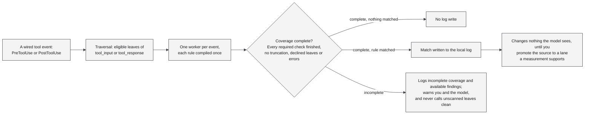

<a id="readme-top"></a>

<div align="center">

# agent-defs

**Definitions for agent security.**

[](https://pypi.org/project/agent-defs/)
[](#licence)
[](https://github.com/yzhao062/agent-defs/actions/workflows/evaluator.yml)

[Install](#install-and-what-a-finding-does) &nbsp;•&nbsp;
[What it is for](#what-it-is-for) &nbsp;•&nbsp;
[Measured attack catch rate](#measured-attack-catch-rate) &nbsp;•&nbsp;
[What it will not do](#what-it-will-not-do) &nbsp;•&nbsp;
[Sources](#sources)

</div>

Definitions for agent security: public rule sets and risk corpora, normalized, carrying where each
rule came from, watched for changes, and preserved after the source disappears. Install it and your
own agent checks the text it reads before the model acts on it.

**Status: pre-alpha, nothing published beyond a name reservation.** `0.0.1` on PyPI and npm holds the
name and carries no rules. The bundle that ships today catches **2.1173%** of a held-out attack pool,
one that is almost never this hook's surface. The shipped hook catches the same samples the offline
scanner does. [Measured attack catch rate](#measured-attack-catch-rate) has the result and its limits.

> [!WARNING]
> This measures detection and not prevention. Every enabled rule ships in the record-only lane, so a
> completed catch is a log line: it withholds nothing and adds no model context. The interruption
> rate from these detections is zero by construction rather than by measurement. An incomplete scan
> is the one exception: it warns you and the model both.

## What it is for

An agent reads tens of thousands of tokens you never see: web pages, issues, files, tool responses. If
any of that carries instructions, the model may follow them, and you have no way to notice. That is
the one threat here an individual cannot defend against alone, and it is what this package is aimed
at.

It acts at the moment the text arrives rather than producing a report you have to read. Three moments
are reachable in principle; two are wired.

| Moment | What is caught | State here |
|---|---|---|
| A tool result comes back | instructions addressed to your agent, carried in the returned text | **wired.** 209 rules on Claude Code's `PostToolUse`, being 205 from the corpus plus 4 starter rules; see [`docs/calibration.md`](docs/calibration.md) |
| A tool call is about to run | the call does something you did not authorise | **wired.** 11 rules on `PreToolUse`. Of the corpus's 57 `IN` rules, 43 do not run and 3 are held back after firing on selection-stage tool *results*, which is not the surface they run on |
| A skill or server is added | an install step piping a download into a shell, a plaintext secret, a declaration of no `tools` beside authority over all of them | **not reachable.** `cfg.py` and the worker's `cfg` mode implement it and the tests exercise it, but no harness path arrives there: there is no installer hook, and `read_config` refuses any surface but `IN` and `OUT` |

Claude Code, Codex and Copilot each expose all three interception points. Only Claude Code has an
adapter here, and that is a statement about this package rather than about those harnesses.

Wired does not yet mean acting. A registered hook scans and writes matches to the local log from the
first call, and every rule starts in a record-only lane, so a completed match changes nothing the
model sees until you explicitly promote its source to a lane a measurement supports.



This is the path a wired tool event takes. A complete scan with no finding writes nothing. The bundle
fired once in 1,743 held-out tool results. That joined-text measurement does not establish how often
the deployed hook will match or write a log; [Calibrating and promoting a
source](#calibrating-and-promoting-a-source) gives its sampling and selection limits. Completed
findings are logged when the log is writable. An incomplete scan also records its coverage and warns
you and the model.

Benign firing and attack catch rate answer different questions, and a project like this can quietly
report only the first. Measurements on selected traffic produced low observed firing rates and
nominal binomial bounds, with their limits set out under [Calibrating and promoting a
source](#calibrating-and-promoting-a-source). The attack measurement produced a low catch rate on its
test pool, described under [Measured attack catch rate](#measured-attack-catch-rate). Read them
together rather than either alone.

## Install, and what a finding does

Read [Measured attack catch rate](#measured-attack-catch-rate) first: the bundle that ships today
catches 2.1173% of a held-out attack pool.

The checkout sets `requires-python = ">=3.9"`, and the core carries no third-party dependency. That
is why the registered hook runs with `-I -S`: no project import path, no user site, no site
initialization.

```sh
git clone https://github.com/yzhao062/agent-defs
cd agent-defs
python -m pip install -e .                               # into a persistent environment
agent-defs install --settings ~/.claude/settings.json    # prints the diff
agent-defs install --settings ~/.claude/settings.json --yes
agent-defs status                                        # what it would do next call
```

Restart Claude Code after changing hook registration. The captured absolute interpreter and package
paths must remain available, so a temporary checkout is suitable for testing rather than a lasting
install. `agent-defs uninstall` prints the removal diff; `agent-defs uninstall --yes` removes this
package's hook and nothing else. Every changing install or uninstall first saves any existing
settings bytes to a backup file.

Everything starts in `RECORD`. A completed `RECORD` finding is written to the local log and changes
nothing the model sees. Findings are JSON lines in `~/.claude/agent-defs/findings.jsonl`, carrying
rule IDs, effective lanes, JSON paths, original character spans and text hashes. Raw tool text is not
logged, and the log is local and never enters the model context. Two other paths still speak, and
they do not speak to the same audience: a scan that could not finish adds a line to the model's
context and a warning to yours, while a diagnostic log that could not be written warns you alone.

## What it will not do

Let unmeasured rules act on completed matches. A security hook that interrupts normal use gets
switched off within a day, and then nothing runs at all. Every executable rule starts in a record-only
lane, and it leaves that lane only on a measured benign firing rate with an exact binomial bound
behind it. That bound is not zero: `lanes.py` admits `ADVISE` at 0.5% and `DENY` at 0.1%, so what a
promoted rule carries is a ceiling on how often it may interrupt you rather than a promise that it
never will. The policy is in [`SCHEMA.md`](SCHEMA.md) and the arithmetic is in `agent_defs/lanes.py`.

## Measured attack catch rate

Held out by origin, the 209 `OUT` rules this hook enables today catch **454 of a 21,442-sample attack
pool, 2.1173%**. Invoked as the harness invokes it, the shipped launcher catches the same 454. Not a
similar number: the same samples, none lost and none gained against the offline scanner. The earlier
run's preregistration predicted 40% to 75% and recorded that expectation as violated, and this result
stays far below it.

The measurement ran to a contract fixed and committed beforehand. Its report scores twelve numerical
predictions, two precommitted readings and one standing commitment against post-hoc changes; all
fifteen rows are recorded as held, and neither conditional reading was triggered.

The anchor is what makes the rest readable. Restricted to the 186 rules this bundle still shares with
the earlier run, today's code catches exactly 417, with every per-rule hit count matching the earlier
run's, identical shared predicates and no eligibility disagreement. On that same pool and scanner the
added `OUT` rules catch 38, one of which the shared set already had, so 37 additional catches are
attributable to those rules here rather than to a change in the plumbing.

| Rules scored | Caught | Recall | Increment |
|---|---:|---:|---:|
| The 186 shared with the earlier run | 417 | 1.9448% | |
| The 205 `OUT` rules in the bundle | 454 | 2.1173% | +37 |
| Plus the 4 starter rules, as shipped | 454 | 2.1173% | **+0** |
| Plus the 11 `IN` rules, which no single event scores | 460 | 2.1453% | +6 |

174 of the 209 catch nothing on this pool. So do all four starter rules, which are hand-written, ship
without a benign measurement of their own, and are the only rules here this package authored. Six
rules account for 80% of the detections and five cover 80% of the distinct samples caught.

Several things bound what the number means.

The pool is almost never this hook's surface. Of the 21,442 samples, 21,043 are user turns and **84 are
shaped like a tool result, 0.39%**. Seventy-nine of those 84 were authored by the upstream rule corpus
itself, leaving five that came from anywhere else. On the surface this hook actually watches, then, the
rules caught 5 of those 84, and 2 of the 5 external ones. The run also relays an expectation that a
channel-matched pool would score higher, citing small origin bins whose catch fractions are higher than
the pool's; those bins are not a representative sample of tool results, and the run puts no size on the
correction. At 84 and at 5, neither the direction nor the magnitude of that change is established here.

It measures detection and not prevention. Every enabled rule ships in the record-only lane, so a
completed catch is a log line: it withholds nothing and adds no model context, and the interruption
rate from these detections is zero by construction rather than by measurement. An incomplete scan is
the exception and still speaks, to you and to the model both, as described under [Install, and what a
finding does](#install-and-what-a-finding-does).

The scoring shape was the most generous one for the budget. Each sample arrived as one event of one
leaf, the largest of them 12,240 bytes, and all 21,442 `OUT` trials completed with no truncation and no
budget-skipped pairs, so no detection here was lost to the deadline. That is why the launcher and the
offline scanner agree exactly on this pool and this host. It is also the reason the run does not
estimate coverage on real tool results, where 16.48% of `OUT` events carry more than three leaves.

An increment is sitting refused. On the earlier run's pool and rule set, 42 rules that do catch attacks
were held out because their benign firing rate is unmeasured, which is the admission policy working as
written. Adding them to that run's 186 would have reached 980 of 21,442, 4.570%. That is arithmetic
about the earlier set rather than a prediction for today's, and the decision is open.

There is no sampling frame behind the 21,442, and no confidence interval is quoted for any figure
here. The pool is a convenience sample from six corpora with a documented composition bias, its
clustering makes a binomial interval on 21,442 wrong, and the corpora were not exhaustively mined even
within themselves. Counts are reported; precision is not claimed.

The run report, the contract it was scored against, the pinned corpora and the attack pool live in a
research record outside this repository, so none of the experiments in this section can be reproduced
from this checkout alone.

Quiet rules do not improve any of this. A bundle that matches nothing has zero observed benign hits
and zero attack hits, and its benign upper bound still depends on the trial count: `lanes.binomial_u95`
returns 25.887% for 0 hits in 10 trials and 0.172% for 0 in 1,743. Silence lowers the bound at a fixed
sample size rather than making it good.

## How much of an event it reads

At most one worker process runs per tool event. Eligible non-empty string leaves of `tool_input` or
`tool_response` go in a single request, within the traversal and byte limits, and the worker compiles
each rule once and runs it against every leaf. The alternative was one worker per leaf, and each leaf
then paid the compilation again: 341 ms of a 492 ms per-leaf floor was compilation, against 4.2 ms of
matching. On the shipped 209-rule `OUT` bundle that left 32.67% of measured tool results with an
incomplete scan, and every result carrying three or more leaves was incomplete.

Largest number of leaves still scanned completely inside the scan budget, measured by bisection over
real `OUT` leaves against that bundle, moved from a median of 1 to a median of 72. That unit is the
wrong one and is kept because it is what was measured. On the Windows machine this was measured on,
the resource deciding the outcome is total scanned text, around 45 to 55 KB an event, so an event of
long leaves runs out sooner than a leaf count suggests. Treat that as a reading for one machine,
bundle and traffic sample rather than a threshold for the platform.

A scan that does not finish says so. It never reports the leaves it did not reach as clean, and the
completeness verdict is checked against the per-leaf record rather than against a summary count. The
1.0 s is the scan budget and not an end-to-end hook guarantee: traversal and worker startup come out
of it, while parsing the response and turning a large set of findings into records is caller-side work
that sits outside it.

## Calibrating and promoting a source

Letting a source act takes a measurement of the set you actually have installed, and then saying so
once:

```sh
agent-defs export-bundle --out enabled.json      # the exact enabled set
python scripts/measure_tool_traffic.py --evidence <dir> --names <corpus> \
    --surface OUT --surface IN --rules enabled.json --workers 4
agent-defs calibrate --report <corpus>-out-in-report.json --accept-pooled-bound
agent-defs promote --source atr --lane ADVISE
```

Both surfaces go in one report. A bundle that enables `IN` and `OUT` is refused
whole if either is unmeasured, so measuring one at a time produces a report
`calibrate` will not take. The lane is then gated on whichever surface bounds
worse, and `calibrate` prints both so you can see which one that was.

`--accept-pooled-bound` is there because a personal corpus will not carry the
roughly 600 clean trials per stratum the benchmark's own gate wants for a
rarely used tool, so its report arrives refused and the flag is where a caller
takes the weaker pooled claim in writing. Drop it and the step above will
refuse.

`promote` refuses a lane the imported evidence does not support and prints what
the change does. The shipped bundle fired once on 1,743 held-out tool results
and on none of the 1,738 tool invocations from the same episodes. Treating those
as independent representative trials gives a nominal one-sided 95% bound of
0.272% on `OUT` and 0.172% on `IN`, and the worse of the two decides the lane:
the importer maps 0.272% to `ADVISE` and not `DENY`. That sampling, and a rule
removed from the bundle after the evaluation was read, are both reasons the
number is not established as a bound on what the deployed hook does. [`docs/calibration.md`](docs/calibration.md) has the procedure, the
corpora, the two gates that disagree about it, and what none of it settles.

## Seeing what an install is doing

`agent-defs status` reports which bundle loaded, counts of enabled rules by
surface and effective lane, and whether the harness settings register this
package's hook.

The hook reads `bundle.json` and never a loader, because the machine running it
has neither the pinned corpora nor a YAML parser, and a corpus fetched from
inside a tool-call hook would be a network request on the critical path of
every tool call.

## The rule is the pattern plus its dispatcher

A pattern lifted out of the engine that dispatches it is a different artifact from
the rule its authors shipped. Measured on ATR's own skill benchmark: the same
patterns matched flat against a skill document flag 155 of 466 benign documents,
and run through ATR's own admission gates they flag 1, which is what ATR itself
flags. ATR records loaded with readable engine sources carry the skill dispatch
gates beside their patterns. The shipped hook bundle has no such bindings and
uses flat predicates. [`docs/cfg.md`](docs/cfg.md) has the gates, where each was
read from, and the before-and-after numbers.

## Sources

Six public corpora, each pinned by commit. The shipped `bundle.json` is ATR-only: it carries 216 of
ATR's 793 records, 205 on `OUT` and 11 on `IN`. Five of the six reserve their configuration names and
are not loaded yet. Redistribution terms are recorded per source and per field, and a source whose
terms are unresolved ships no bytes until they are.

<details>
<summary><b>The six pinned sources</b>, as recorded in <code>sources.lock</code></summary>

Commits appear here as their first eight characters; `sources.lock` carries the full hash, the
archive digest, the licence path and the counting method for each.

| Source | Repository | Commit | Licence | Records at that commit |
|---|---|---|---:|---:|
| `atr` | [Agent-Threat-Rule/agent-threat-rules](https://github.com/Agent-Threat-Rule/agent-threat-rules) | `faf743fe` | MIT | 793 |
| `netzilo` | [netzilo/aidr-sigma](https://github.com/netzilo/aidr-sigma) | `0139a664` | Apache-2.0 | 1156 |
| `agentshield` | [agentshield-ai/agentshield](https://github.com/agentshield-ai/agentshield) | `1bd56f98` | Apache-2.0 | 69 |
| `agent_audit_kit` | [sattyamjjain/agent-audit-kit](https://github.com/sattyamjjain/agent-audit-kit) | `75d1a155` | MIT | 332 |
| `ave` | [aveproject/ave](https://github.com/aveproject/ave) | `3b9fcc00` | Apache-2.0 | 80 |
| `guardana` | [guardana/guardana](https://github.com/guardana/guardana) | `5d6e4174` | Apache-2.0 | 51 |

</details>

## Repo layout

<details>
<summary><b>What each file is</b></summary>

| Path | What |
|---|---|
| `src/agent_defs/model.py` | the normalized record every loader emits |
| `src/agent_defs/evaluate.py` | bounded predicate evaluation, with build-time pattern screening |
| `src/agent_defs/_scan_worker.py` | the disposable child that compiles and matches, killed at an absolute deadline |
| `src/agent_defs/hooks/_core.py` | the traversal: which leaves of an event get scanned, and what is rewritten |
| `src/agent_defs/hooks/claude_code.py` | the command hook itself: the exception boundary and the zero exit |
| `src/agent_defs/hooks/_claude_code_impl.py` | the Claude Code adapter, and the only harness wired |
| `src/agent_defs/hazards.json` | the measured regex timings the screen refuses on |
| `src/agent_defs/cfg.py` | the configuration channel: a rule run the way its source runs it |
| `src/agent_defs/lanes.py` | the four admission lanes and the binomial bound behind them |
| `src/agent_defs/bundle.py` | the distribution format: normalized records frozen into one file |
| `src/agent_defs/bundle.json` | the pinned rules the hook loads, written by `scripts/build_bundle.py` |
| `src/agent_defs/cli.py` | the `agent-defs` command: install, calibrate, report state |
| `SCHEMA.md` | the loader contract |
| [`docs/hazards.md`](docs/hazards.md) | why the screen refuses on measurement rather than on shape |

</details>

## Licence

MIT for this package's own code, in [`LICENSE`](LICENSE). Rule content carries its source's licence,
recorded per record. [`THIRD-PARTY-NOTICES`](THIRD-PARTY-NOTICES) lists source licences and
attributions and reproduces the Apache-2.0 text.

<div align="center">

<a href="#readme-top">↑ back to top</a>

</div>
